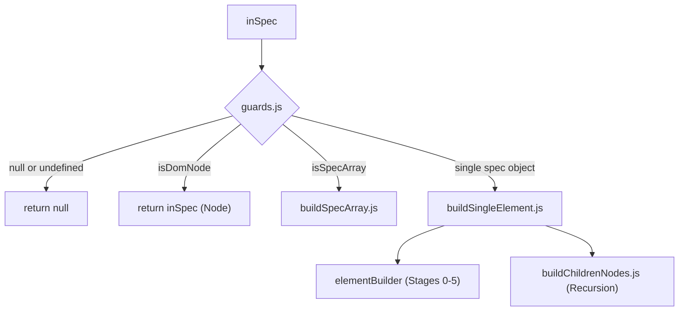

# `src/v2` API Reference

This document provides complete technical reference for all public functions, modules, and builder stages in `src/v2`.

---

## 1. Top-Level Entry Points (`src/v2/index.js`)

### `buildSpecElement(inArgs)`
The primary entry point for converting a JSON specification into native DOM nodes.

#### Parameters
| Parameter | Type | Required | Default | Description |
|---|---|---|---|---|
| `inArgs.inSpec` *(or `inArgs.spec`)* | `object \| Array \| Node \| null` | Yes | `undefined` | The specification to compile. Can be a single element spec, an array of specs, or a live DOM Node. |
| `inArgs.inShowLog` | `boolean` | No | `false` | When `true`, enables internal warnings (e.g. invalid operations). |

#### Returns
- `HTMLElement` — If `inSpec` is an element object.
- `Array<HTMLElement>` — If `inSpec` is an array of element objects.
- `Node` — If `inSpec` was already a live DOM `Node`.
- `null` — If `inSpec` is `null`, `undefined`, or invalid.

#### Example
```javascript
import { buildSpecElement } from "./src/v2/index.js";

const heading = buildSpecElement({
  inSpec: {
    tagName: "h1",
    classList: "display-4 text-primary",
    textContent: "Welcome"
  }
});
```

---

### `specToDom(inArgs)`
Alias for `buildSpecElement`. Maintained for backwards-compatibility.

```javascript
import { specToDom } from "./src/v2/index.js";

const el = specToDom({ spec: { tagName: "p", textContent: "Hello" } });
```

---

### `buildSpec(inArgs)`
Direct access to the internal spec dispatcher (`src/v2/buildSpec/index.js`).

#### Parameters
| Parameter | Type | Description |
|---|---|---|
| `inArgs.inSpec` | `any` | The specification object, array, or Node. |
| `inArgs.inShowLog` | `boolean` | Enables console warnings if `true`. |

```javascript
import { buildSpec } from "./src/v2/index.js";

const button = buildSpec({
  inSpec: { tagName: "button", textContent: "Save" }
});
```

---

### `meta`
Metadata object describing the engine.

```javascript
import { meta } from "./src/v2/index.js";

console.log(meta.version);     // "v2.0"
console.log(meta.description); // "Pure DOM engine only from json with activation"
```

---

## 2. Browser Global Registration (`src/v2/registerGlobal.js`)

When imported in any environment where `globalThis` is available, `registerGlobal` automatically populates the `ks` namespace:

```javascript
globalThis.ks["json-to-dom"] = {
  meta: { version: "v2.0", description: "..." },
  buildSpecElement: function(...)
};
```

### Usage in plain HTML:
```html
<script type="module" src="./src/v2/index.js"></script>
<script type="module">
  const el = window.ks["json-to-dom"].buildSpecElement({
    inSpec: { tagName: "div", textContent: "Rendered via global window.ks" }
  });
  document.body.appendChild(el);
</script>
```

---

## 3. Dispatcher Pipeline (`src/v2/buildSpec/`)

The dispatcher inspects the input type and routes execution appropriately:



### Guards (`guards.js`)
- `isNullOrUndefined({ inSpec })`: Returns `true` if `inSpec === null || inSpec === undefined`.
- `isDomNode({ inSpec })`: Returns `true` if `inSpec instanceof Node`.
- `isSpecArray({ inSpec })`: Returns `true` if `Array.isArray(inSpec)`.

### Array Handling (`buildSpecArray.js`)
- Maps every element through `dispatchSpec(...)`.
- Flattens nested arrays (`.flat()`).
- Filters out nullish values (`.filter(Boolean)`).

### Recursive Children Resolution (`buildChildrenNodes.js`)
- Iterates over `localSpec.children`.
- Dispatches each child back into the dispatcher, allowing unlimited nesting depth.

---

## 4. Element Assembly Line (`elementBuilder/`)

`domElementBuilder({ inSpec, inClassList })` executes 6 discrete stages:

### Stage 0: `0.createElement.js`
- **Function**: `createElement({ inTagName })`
- **Logic**:
  - Lowercases tag name: `inTagName?.toLowerCase()`.
  - **Special tag alias**: If `tagName === "checkbox"`, creates `<input type="checkbox">`.
  - Otherwise invokes `document.createElement(localTagName)`.

### Stage 1: `1.applyTextContent.js`
- **Function**: `applyTextContent({ inElement, inTextContent, inAllowsTextContent = true, inTagName, inShowLog })`
- **Logic**:
  - Sets `element.textContent = localTextContent`.
  - If `inAllowsTextContent` is `false`, logs a warning (if `inShowLog: true`) and skips assignment.

### Stage 2: `2.applyProperties.js`
- **Function**: `applyProperties({ inElement, inProperties })`
- **Logic**:
  - Directly assigns JavaScript properties onto the DOM element instance using `Object.assign(localElement, localProperties)`.
  - Useful for properties like `id`, `value`, `checked`, `tabIndex`, or event listeners like `onclick`.

### Stage 3: `3.applyAttributes.js`
- **Function**: `applyAttributes({ inElement, inAttributes })`
- **Logic**:
  - Iterates key/value pairs of `inAttributes`.
  - Special key `"class"`: sets `element.className = val`.
  - Boolean `true`: sets empty attribute `element.setAttribute(attrName, "")` (e.g. `disabled`, `readonly`, `hidden`).
  - Boolean `false`: removes attribute `element.removeAttribute(attrName)`.
  - String / Number: sets `element.setAttribute(attrName, String(val))`.

### Stage 4: `4.applyClassList.js`
- **Function**: `applyClassList({ inElement, inClassList })`
- **Logic**:
  - Supports string format: splits on whitespace `localClassList.split(/\s+/)`.
  - Supports array format: filters empty or non-string tokens.
  - Adds valid tokens via `element.classList.add(...classesToAdd)`.

### Stage 5: `5.appendChildren.js`
- **Function**: `appendChildren({ inElement, inChildren, inAllowsChildren = true, inTagName, inShowLog })`
- **Logic**:
  - If child is an instance of `Node`, appends via `element.appendChild(child)`.
  - If child is a string or number, wraps in `document.createTextNode(String(child))` and appends.
